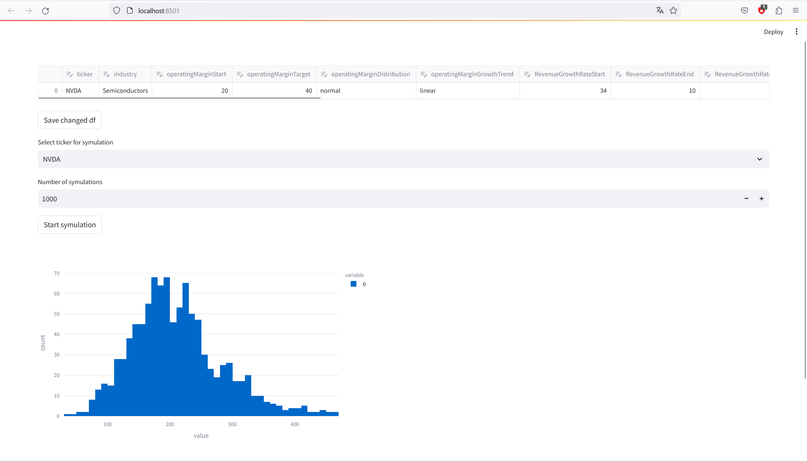

# Financial Modeling and Portfolio Optimization

## Overview

This Python-based project combines probabilistic company valuation, time series simulation models, and Efficient Frontier analysis to provide a comprehensive framework for investors. The project challenges the assumption of market efficiency and aims to enhance simulation based decision-making in the financial markets.

## Project Phases

### 1. Probabilistic Valuation Framework

- **Objective:** Challenge market efficiency assumptions by deriving a distribution of company stock prices using a probabilistic Discounted Cash Flow (DCF) valuation model.
  
- **Key Components:**
  - Data Collection
  - DCF Model Implementation
  - Monte-Carlo Simulation Techniques

<p align="center">

</p>

### 2. Simulation Models Integration

- **Objective:** Enhance the probabilistic valuation by integrating two simulation models - a proprietary one based on company valuation distributions and a Geometric Brownian Motion (GBM) model.

- **Key Components:**
  - Custom Simulation Model
  - GBM Model
  - Methodology
  - Expected Outcomes

### 3. Portfolio Optimization with Efficient Frontier Analysis

- **Objective:** Construct optimal portfolios by incorporating insights from probabilistic valuation, simulation models, and Efficient Frontier analysis.

- **Key Components:**
  - Efficient Frontier Analysis
  - Optimal Portfolio Construction

## Getting Started

```sh
pip install -r requirements.txt
```
```sh
streamlit run dashboard.py
```